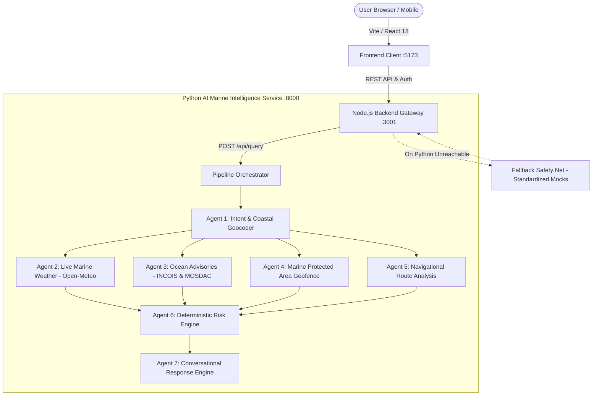

# NEER — Marine & Coastal Intelligence Platform

NEER is a comprehensive full-stack marine and coastal safety intelligence platform designed for Indian coastal communities, traditional artisanal fishermen, commercial maritime operators, and coastal disaster management authorities.

The platform integrates real-time meteorological feeds, official government fishing advisories, high-precision geospatial boundary analysis, and multi-agent AI reasoning to provide actionable, localized decision support in English and Hindi.

---

## System Architecture



---

## Core Capabilities

### 1. Persona-Specific Workspaces
* **Traditional Fisherman Workspace**: One-click harbour and coastal safety assessment, wave height, swell period, wind speed, official INCOIS Potential Fishing Zones (PFZ) distances, and tide schedules.
* **Coastal Authority Workspace**: Regional coastal risk overview, priority ranking for monitored coastal sectors (e.g. Ernakulam, Alappuzha, Thrissur), draft advisory generation, and broadcast targeting.
* **Maritime Operations Workspace**: Coastal passage planning, transit route hazard evaluation, swell surge warnings across navigation segments, and vessel-specific operating limits.

### 2. Live Data Integrations
* **Open-Meteo Marine & Forecast APIs**: Live concurrent fetching of hourly wave height, swell height, swell period, ocean surface currents, sea surface temperature (SST), and 10m wind speeds.
* **INCOIS PFZ Scraper**: Live extraction of official government Potential Fishing Zone advisories directly from INCOIS portal text bulletins, calculating accurate Haversine distances to the nearest productive fishing coordinates.
* **Marine Protected Areas (MPAs)**: High-resolution spatial polygon boundary engine detecting entry into protected maritime reserves (e.g. Vembanad Lake, Gulf of Mannar).

### 3. Conversational AI Assistant ("Ask NEER")
* **Dual Language Voice & Text**: Full support for English and Hindi with dynamic language switching.
* **Hands-Free Speech Input**: Web Speech API integration with continuous speech recognition, interim transcripts, auto-send on speech completion, and graceful privacy browser fallbacks.
* **Narrow-Topic Intelligence**: Intelligently identifies single-topic queries (*"sst near vizag"*, *"what is the wave height"*, *"my safety score"*) and provides concise 1–2 sentence factual answers without repetitive multi-page reports.
* **Typo & Colloquial Resilience**: Recognizes phonetic variations, common misspellings (e.g. *"chllorophyll"*, *"klorofil"*), and informal Hindi queries (*"samudri satah ka tapman"*, *"hawa ki gati"*).

### 4. Interactive Geospatial Map
* **Structured Location Inspector**: Clicking any point along the coast displays live conditions in a clean, structured 2-column card (Wave Height, Wind Speed, Swell Period, SST, PFZ Distance, Currents) rather than raw text paragraphs.

### 5. Persistent Authentication & Persona Memory
* User registration and login backed by Node.js persistent JSON storage (`users_db.json`).
* Automatically restores the user's preferred persona on return visits, bypassing the role picker.
* Unauthenticated browsing protections (`SelectPersonaFirst` guard banner across protected tabs).

### 6. Transparent Fallback Safety Net
* If the Python AI service is ever temporarily stopped or unreachable, the system never crashes; it serves standardized sample data with `provenance.status = "fallback"`.
* Visible amber alert banners (`FallbackNotice`) appear across the dashboard and chat modal so users are never misled into mistaking demo data for live real-time conditions.

---

## Repository Layout

```
.
├── backend/                     # Node.js Express API & Gateway (Port 3001)
│   ├── controller/              # Auth, analysis, and chat controllers
│   ├── model/                   # Data access, userStore (users_db.json), Python service proxy
│   ├── route/                   # Express routes (/api/auth, /api/analysis, /api/chat)
│   ├── mocks/                   # Verified sample response envelopes & users_db.json
│   └── index.js                 # Server entry point & CORS configuration
│
├── neerfd/                      # React Frontend Application (Port 5173)
│   └── frontend/
│       ├── src/
│       │   ├── components/      # UI components, layout, chat modal, interactive maps
│       │   ├── context/         # AuthContext & LanguageContext
│       │   ├── pages/           # Fisherman, Authority, Marine, Auth, and Persona pages
│       │   ├── i18n/            # English & Hindi translation dictionaries
│       │   └── hooks/           # useMarineAnalysis data hook
│       ├── package.json
│       └── vite.config.js       # Vite bundler & API proxy configuration
│
└── NEER-main/                   # Python AI & Ocean Intelligence Microservice (Port 8000)
    ├── agents/                  # 7-Agent Architecture:
    │   ├── agent_1_intent.py    # Intent parsing, geocoding & inland filtering
    │   ├── agent_2_weather.py   # Live Open-Meteo concurrent fetcher
    │   ├── agent_3_ocean.py     # Live INCOIS PFZ scraper & MOSDAC scaffold
    │   ├── agent_4_geofence.py  # MPA spatial polygon boundary checker
    │   ├── agent_5_route.py     # Navigational transit segment analyzer
    │   ├── agent_6_risk.py      # Deterministic marine risk & scoring engine
    │   └── agent_7_response.py  # Response synthesis & multilingual prose
    ├── services/                # Geocoding gazetteer, payload builders, Sarvam LLM client
    ├── pipeline.py              # End-to-end multi-agent orchestration
    └── api.py                   # FastAPI service exposing POST /api/query
```

---

## Quickstart Guide

### Prerequisites
* **Node.js**: v18+ and `npm`
* **Python**: v3.10+ with `pip` and virtual environment support

### 1. Start the Python AI Microservice
```bash
cd NEER-main
python3 -m venv .venv
source .venv/bin/activate
pip install -r requirements.txt
uvicorn api:app --port 8000
```
*Health Check*: `http://localhost:8000/health`

### 2. Start the Node.js Backend Gateway
```bash
cd backend
npm install
node index.js
```
*Health Check*: `http://localhost:3001/health`

### 3. Start the Frontend Application
```bash
cd neerfd/frontend
npm install
npm run dev
```
*Access the Web UI*: `http://localhost:5173`

---

## Automated Test Suites

Run the project verification tests across the stack:

```bash
# 1. Python Multi-Agent Extended Tests (Safe word leak, narrow topics, inland gating)
./NEER-main/.venv/bin/python scratch/test_python_pipeline_features.py

# 2. Python Core Thresholds & GeoJSON Tests
./NEER-main/.venv/bin/python -m unittest discover NEER-main/tests

# 3. Backend Auth & Persistence Tests
node backend/test_auth.js

# 4. Fallback Visibility & Provenance Tests
node scratch/test_fallback_visibility.mjs

# 5. Map Cards & Voice Input Feature Tests
node scratch/test_map_and_voice_features.mjs

# 6. Frontend Production Build Verification
npm --prefix neerfd/frontend run build
```

---

## Proprietary Notice

Copyright © 2026. All rights reserved. This software is proprietary and confidential — not licensed for open-source or public distribution.
